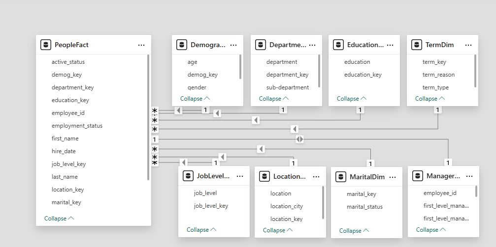
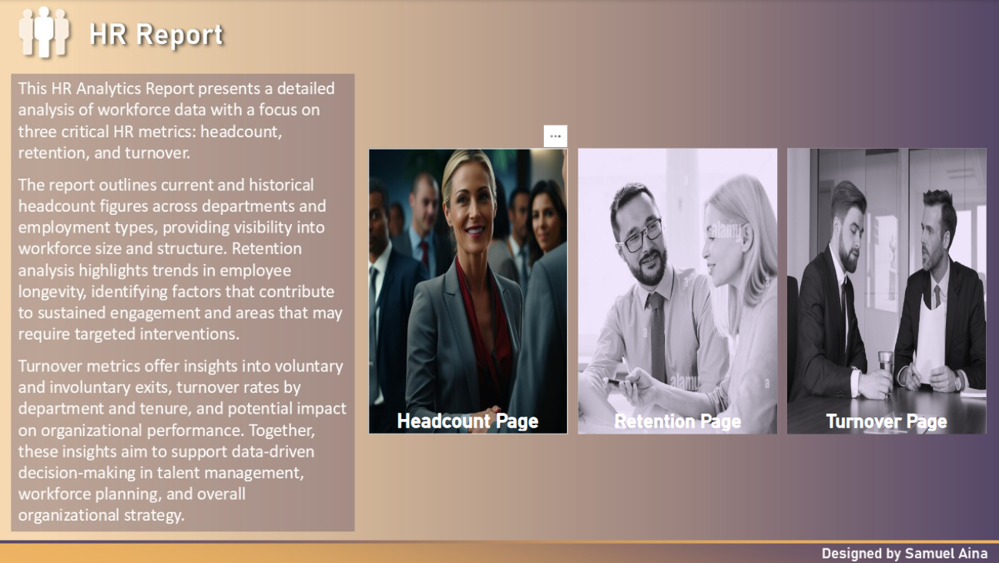
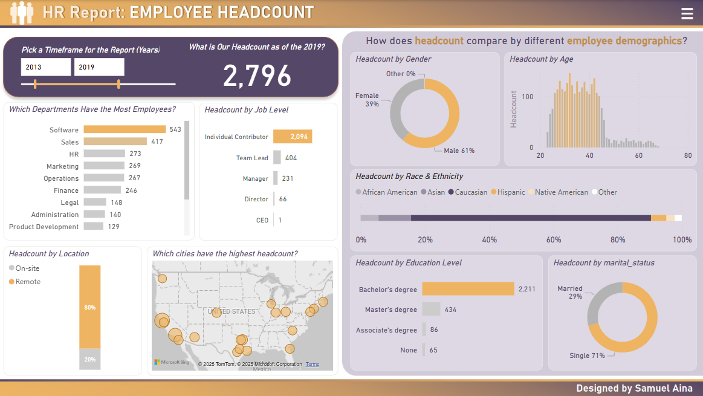
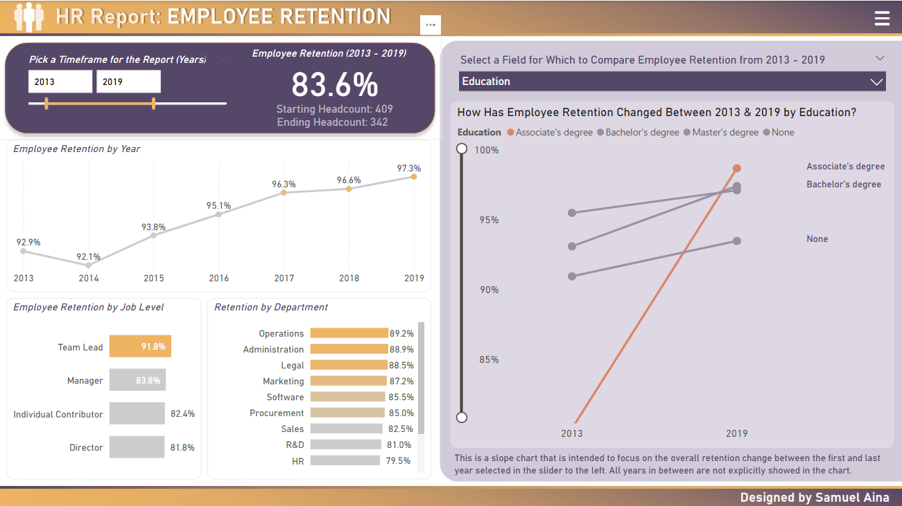
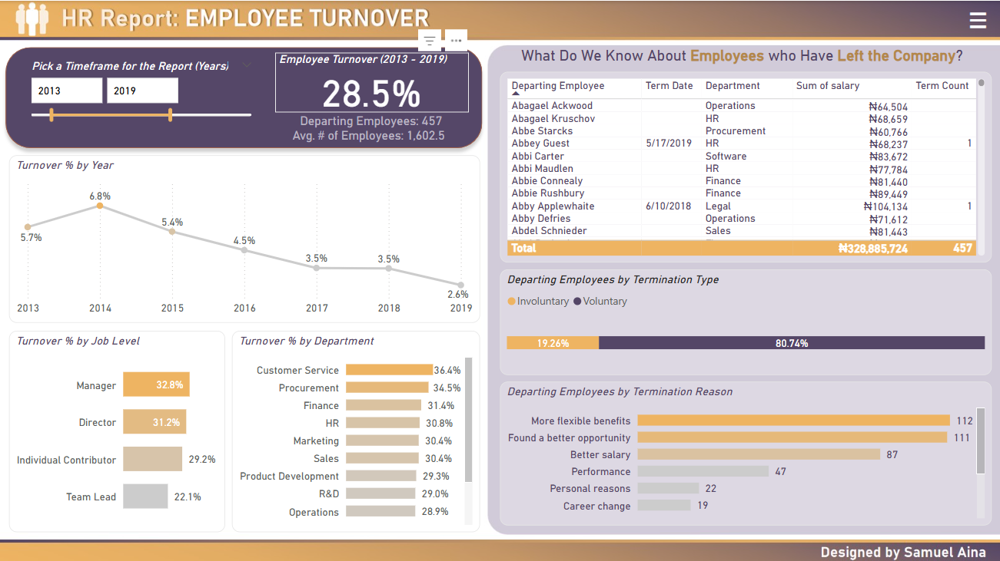

# HR Dashboard Project (Power BI)

This HR dashboard project was developed using **Power BI** to provide actionable insights into key workforce metrics. It focuses on **headcount**, **employee retention**, and **turnover trends** from 2013 to 2019. Designed for strategic HR decision-making, it visualizes critical organizational data using modern data transformation techniques, interactive filtering, and DAX measures.

---

## Skills and Concepts Demonstrated

- Power BI Desktop proficiency  
- Data cleaning and transformation using Power Query  
- Star schema dimensional modeling  
- Merging and appending datasets  
- Advanced DAX for KPI calculations  
- Date and time intelligence  
- Drill-through, slicers, and parameters  
- Visual storytelling and user-friendly dashboard layout  
- Debugging data type and locale issues (e.g., date parsing)

---

## Problem Statement

The organization lacked a centralized, visual method to analyze HR metrics such as:

- Total employee count over time  
- Retention rates by department, job level, and demographics  
- Turnover analysis including reasons and termination types  

Existing data was stored in disparate CSV files and required transformation into a robust data model for accurate analysis and reporting.

---

## Data Modelling

### Data Preparation

- Loaded multiple CSVs and disabled direct load to reduce clutter  
- Grouped queries into **Source** and **Production** layers  
- Created a clean `PeopleFact` table by merging and indexing various dimension tables  
- Added calculated fields including Full Name, Age, and Years at Company  
- Resolved date locale issues (MM/DD/YYYY vs DD/MM/YYYY) for accurate birthdate parsing

### Key Tables Created

**Fact Table:**
- `PeopleFact` – Core employment records  

**Dimension Tables:**
- `DepartmentDim`  
- `JobLevelDim`  
- `TermDim`  
- `ManagerDim` (First–Fourth level managers merged and formatted)  
- `DemographicDim` (Gender, Race, Age)  
- `LocationDim`  
- `MaritalDim`

---

## Visualizations

### Cover Page

Created an interactive Cover page used to navigate to any part of the project and also showing a breif summary of the project.

### Headcount Page

- **Total Headcount (2019):** 2,796  
- **Top Departments:** Software (543), Sales (417), HR (273)  
- **Headcount by Job Level:**  
  - Individual Contributor: 2,094  
  - Team Lead: 404  
  - Manager: 231  
  - Director: 66  
  - CEO: 1  
- **Gender Breakdown:** 61% Male, 39% Female  
- **Remote vs On-site:** 80% Remote, 20% On-site  
- **Marital Status:** 71% Single, 29% Married  
- **Education Level:**  
  - Bachelor's: 2,211  
  - Master’s: 434  
  - Associate: 86  
  - None: 65  
- **Other Visuals:** Headcount by Race, City-level heat map, Clustered and stacked charts by demographics

### Retention Page

- **Overall Retention (2013–2019):** 83.6%  
- **Yearly Retention Range:** 92.9% (2013) to 93.8% (2019)  
- **Retention by Job Level:**  
  - Team Lead: 91.8%  
  - Manager: 83.8%  
  - Individual Contributor: 82.4%  
  - Director: 81.8%  
- **Retention by Department:**  
  - Highest: Operations (89.2%), Administration (88.9%)  
  - Lowest: HR (79.5%)  
- **Starting vs Ending Headcount:** 409 → 342  
- **Slope Chart:** Retention by education level  
- **Parameterized Slicer:** Compare demographics (gender, location, education, etc.)

### Turnover Page

- **Overall Turnover (2013–2019):** 28.5%  
- **Departing Employees:** 457  
- **Average Employee Count:** 1,602  
- **Turnover by Job Level:**  
  - Manager: 32.8%  
  - Director: 31.2%  
  - Individual Contributor: 29.2%  
  - Team Lead: 22.1%  
- **Turnover by Department:**  
  - Highest: Customer Service (36.4%), Procurement (34.5%)  
  - Notable: HR (30.8%), Finance (31.4%)  
- **Termination Type:**  
  - Voluntary: 80.74%  
  - Involuntary: 19.26%  
- **Top Termination Reasons:**  
  - Flexible Benefits: 112  
  - Better Opportunities: 111  
  - Better Salary: 87  
  - Performance: 47  
  - Personal Reasons: 22  
  - Career Change: 19

---

## Analysis

- **Workforce Growth:** Strong headcount by 2019 indicates stable hiring with remote work dominating.  
- **Retention Strengths:** High retention in leadership roles and departments like Operations and Administration.  
- **Turnover Risks:** High voluntary turnover in Customer Service and Procurement highlights need for HR intervention.  
- **Demographic Impact:** Diverse workforce distribution across gender, race, education, and age.

---

## Conclusion and Recommendations

The dashboard provides a centralized, data-driven overview of workforce dynamics. It enables HR to:

- Track and benchmark headcount trends  
- Identify high-turnover or low-retention departments  
- Make informed staffing and engagement decisions  

### Recommendations:

- **Strategic Retention Planning:** Focus on high-turnover departments  
- **Optimize Benefits and Compensation:** Address most cited termination reasons  
- **Strengthen Leadership Pipelines:** Leverage success at the team-lead level  
- **Expand Analysis:** Integrate performance and engagement metrics  
- **Automate Data Refresh:** Schedule monthly updates for real-time insights
